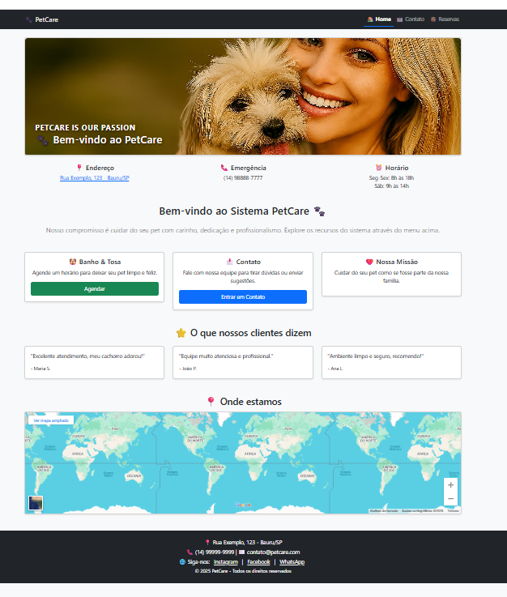

# django-contact-reservation-api

# 🚀 Django Project  
## 📬 Contact + 📅 Reservas + 🐾 Categorias + 🌐 API REST

 


---

## 🏅 Badges

- 📦 Tamanho do repositório:  
  

- 📄 Licença do projeto:  
  

---

## 📋 Índice / Table of Contents

- [📖 Descrição / Description](#-descrição--description)  
- [📌 Status do Projeto / Project Status](#-status-do-projeto--project-status)  
- [⚙️ Funcionalidades / Features](#-funcionalidades--features)  
- [🚀 Execução / Execution](#-execução--execution)  
- [🌐 Acesso / Access](#-acesso--access)  
- [🧰 Tecnologias / Technologies](#-tecnologias--technologies)  
- [🧪 Testes da API / API Tests](#-testes-da-api--api-tests)  
- [📌 Evolução](#-evolução)  
- [🔄 Comparativo de Evolução](#-comparativo-de-evolução)  
- [📌 Nota sobre o Projeto](#-nota-sobre-o-projeto)  
- [👨‍💻 Desenvolvedor / Developer](#-desenvolvedor--developer)  
- [📜 Licença / License](#-licença--license)  
- [🏁 Conclusão / Conclusion](#-conclusão--conclusion)

---

## 📖 Descrição / Description

**PT:**  
Este projeto é a **evolução** do mini projeto anterior da **Django-Mini-Project---Contact-Page-Ultima**.  
Agora, além da página de contato, foi adicionado um **sistema de reservas**, um módulo de **categorias de animais** e uma **API REST completa** utilizando **Django REST Framework**.  

O sistema permite:  
- Criar e gerenciar **contatos**, **reservas** e **categorias** via páginas HTML  
- Relacionar reservas a categorias de animais  
- Consultar todas as reservas de uma categoria específica através do endpoint `/api/categorias/<id>/reservas/`  
- Gerenciar tudo pelo **Django Admin**  
- Consumir e testar a API via **Postman**  
- Usar **filtros, busca e ordenação** nos endpoints da API  

**EN:**  
This project is the **evolution** of the previous mini project from **Django-Mini-Project---Contact-Page-Ultima**.  
In addition to the contact page, it now includes a **reservation system**, an **animal categories module**, and a **full REST API** built with **Django REST Framework**.  

The system allows:  
- Creating and managing **contacts**, **reservations**, and **categories** via HTML pages  
- Linking reservations to animal categories  
- Retrieving all reservations of a specific category through the endpoint `/api/categorias/<id>/reservas/`  
- Managing everything through the **Django Admin**  
- Consuming and testing the API with **Postman**  
- Using **filters, search, and ordering** in API endpoints  

---

## 📌 Status do Projeto / Project Status


**PT:**  
Este projeto foi **concluído** e está mantido aqui apenas como **referência histórica**.  

---

## ⚙️ Funcionalidades / Features

| 🧩 Funcionalidade (PT)                          | 💡 Description (EN)                          |
|------------------------------------------------|----------------------------------------------|
| 📬 Página de contato em `/contato/`            | 📬 Contact page at `/contato/`               |
| 📅 Página de reservas em `/reserva/`           | 📅 Reservation page at `/reserva/`           |
| 🐾 Gestão de categorias de animais             | 🐾 Animal categories management              |
| 🔗 Relacionamento Categoria ↔ Reserva com endpoint `/api/categorias/<id>/reservas/` | 🔗 Category ↔ Reservation relationship with endpoint `/api/categorias/<id>/reservations/` |
| 💾 Salvamento no banco de dados                | 💾 Database persistence                      |
| 🔐 Gerenciamento via Django Admin              | 🔐 Management via Django Admin               |
| 🎨 Templates com Bootstrap                     | 🎨 Templates styled with Bootstrap           |
| 🌐 API REST para Contatos, Reservas e Categorias | 🌐 REST API for Contacts, Reservations and Categories |
| 🔎 Filtros, busca e ordenação na API           | 🔎 Filters, search and ordering in API       |
| 🧪 Testes via Postman Collection               | 🧪 Testing via Postman Collection            |

---

## 🚀 Execução / Execution

**PT-BR:**

1. Clone o repositório  
   ```bash
   git clone https://github.com/Rogerio5/django-contact-reservation-api.git
   cd django-contact-reservation-api
   
2. Crie um ambiente virtual e instale as dependências

```bash
  python -m venv venv
  venv\Scripts\activate   # Windows
  source venv/bin/activate  # Linux/Mac
  pip install -r requirements.txt
```

3. Execute as migrações

```bash
  python manage.py migrate
```

4. Crie um superusuário para acessar o admin

```bash
  python manage.py createsuperuser
```

5. Rode o servidor

```bash
  python manage.py runserver
```

6. Acesse no navegador:

  Página de contato: http://127.0.0.1:8000/contato/
  
  Página de reservas: http://127.0.0.1:8000/reserva/
  
  Painel admin: http://127.0.0.1:8000/admin/
  
  API Contatos: http://127.0.0.1:8000/contato/api/contatos/
  
  API Reservas: http://127.0.0.1:8000/contato/api/reservas/


EN:

1. Clone the repository

```bash
  git clone https://github.com/Rogerio5/django-contact-reservation-api.git
  cd django-contact-reservation-api
```

2. Create a virtual environment and install dependencies

```bash
  python -m venv venv
  venv\Scripts\activate   # Windows
  source venv/bin/activate  # Linux/Mac
  pip install -r requirements.txt
```

3. Run migrations

```bash
  python manage.py migrate
```

4. Create a superuser for admin access

```bash
  python manage.py createsuperuser
```

5. Run the server

```bash
  python manage.py runserver
```

6. Access in browser:

  Contact page: http://127.0.0.1:8000/contato/
  
  Reservation page: http://127.0.0.1:8000/reserva/
  
  Admin panel: http://127.0.0.1:8000/admin/
  
  Contacts API: http://127.0.0.1:8000/contato/api/contatos/
  
  Reservations API: http://127.0.0.1:8000/contato/api/reservas/

  ---

  ## 🌐 Acesso / Access

- [🔗 Repositório GitHub / GitHub Repository](https://github.com/Rogerio5/django-contact-reservation-api)

---

## 🧰 Tecnologias / Technologies

**PT:**  
Este projeto foi desenvolvido utilizando as seguintes tecnologias e ferramentas:  

**EN:**  
This project was built using the following technologies and tools:  

<p align="left">
  <!-- Linguagem -->
  
  
  <!-- Framework principal -->
  
  
  <!-- Banco de dados -->
  
  
  <!-- Frontend -->
  
  
  
  <!-- API -->
  

</p>

---

## 🧪 Testes da API / API Tests

### 📬 Contatos / Contacts

- **GET `/api/contatos/`**  
  - PT: lista todos os contatos  
  - EN: lists all contacts  

- **POST `/api/contatos/`**  
  - PT: cria um novo contato  
  - EN: creates a new contact  

- **GET `/api/contatos/<id>/`**  
  - PT: retorna os detalhes de um contato específico  
  - EN: returns details of a specific contact  

- **PUT `/api/contatos/<id>/`**  
  - PT: atualiza um contato existente  
  - EN: updates an existing contact  

- **DELETE `/api/contatos/<id>/`**  
  - PT: exclui um contato  
  - EN: deletes a contact  

---

### 📅 Reservas / Reservations

- **GET `/api/reservas/`**  
  - PT: lista todas as reservas  
  - EN: lists all reservations  

- **POST `/api/reservas/`**  
  - PT: cria uma nova reserva  
  - EN: creates a new reservation  

- **GET `/api/reservas/<id>/`**  
  - PT: retorna os detalhes de uma reserva específica  
  - EN: returns details of a specific reservation  

- **PUT `/api/reservas/<id>/`**  
  - PT: atualiza uma reserva existente  
  - EN: updates an existing reservation  

- **DELETE `/api/reservas/<id>/`**  
  - PT: exclui uma reserva  
  - EN: deletes a reservation  

---

### 🐾 Categorias / Categories

- **GET `/api/categorias/`**  
  - PT: lista todas as categorias  
  - EN: lists all categories  

- **POST `/api/categorias/`**  
  - PT: cria uma nova categoria  
  - EN: creates a new category  

- **GET `/api/categorias/<id>/`**  
  - PT: retorna os detalhes de uma categoria específica  
  - EN: returns details of a specific category  

- **PUT `/api/categorias/<id>/`**  
  - PT: atualiza uma categoria existente  
  - EN: updates an existing category  

- **DELETE `/api/categorias/<id>/`**  
  - PT: exclui uma categoria  
  - EN: deletes a category  

- **GET `/api/categorias/<id>/reservas/`**  
  - PT: retorna todas as reservas (animais) de uma categoria específica  
  - EN: returns all reservations (animals) of a specific category  

---

### 🔎 Filtros e Busca / Filters and Search

- **`?data=2025-09-30`**  
  - PT: filtra reservas por data  
  - EN: filters reservations by date  

- **`?search=Rex`**  
  - PT: busca reservas pelo nome do pet  
  - EN: searches reservations by pet name  

- **`?ordering=-data`**  
  - PT: ordena reservas por data decrescente  
  - EN: orders reservations by date (descending)  

---

## 🧪 Testes com Postman / Postman Tests

**PT:**  
Este projeto já inclui uma **coleção do Postman** (`postman_collection.json`) para facilitar os testes da API.  

### ⚙️ Configuração do Ambiente no Postman

1. Abra o **Postman** e vá em **Environments** → **Add**.  
2. Crie um ambiente chamado **Django API**.  
3. Adicione as variáveis:

| Variável     | Valor (exemplo)                | Descrição |
|--------------|--------------------------------|-----------|
| `auth_token` | `seu_token_gerado_no_django`   | Token de autenticação (obtido via login ou admin). |
| `url`        | `http://127.0.0.1:8000`        | Endereço base da API. |

4. Clique em **Save** e selecione o ambiente no canto superior direito do Postman.  

---

**EN:**  
This project already includes a **Postman collection** (`postman_collection.json`) to make API testing easier.  

### ⚙️ Setting up the Environment in Postman

1. Open **Postman** and go to **Environments** → **Add**.  
2. Create an environment named **Django API**.  
3. Add the following variables:

| Variable     | Value (example)                | Description |
|--------------|--------------------------------|-------------|
| `auth_token` | `your_token_generated_in_django` | Authentication token (obtained via login or admin). |
| `url`        | `http://127.0.0.1:8000`        | Base URL of the API. |

4. Click **Save** and select the environment in the top right corner of Postman.  

---

### ▶️ Endpoints disponíveis na coleção / Available endpoints in the collection

- **Contatos / Contacts** → CRUD completo em `/api/contatos/`  
- **Reservas / Reservations** → CRUD completo em `/api/reservas/`  
- **Categorias / Categories** → CRUD completo em `/api/categorias/`  
  - Inclui o endpoint especial:  
    - **GET `/api/categorias/<id>/reservas/`** → retorna todas as reservas (animais) de uma categoria específica  

---

### ▶️ Executando as requisições / Running the requests

- **Listar Contatos / List Contacts** → `GET {{url}}/contato/api/contatos/`  
- **Criar Contato / Create Contact** → `POST {{url}}/contato/api/contatos/`  
- **Listar Reservas / List Reservations** → `GET {{url}}/contato/api/reservas/`  
- **Criar Reserva / Create Reservation** → `POST {{url}}/contato/api/reservas/`  

As requisições já estão configuradas para usar:  
- `{{url}}` → substituído pelo endereço do ambiente / replaced by the environment base URL.  
- `{{auth_token}}` → substituído pelo token salvo no ambiente / replaced by the token saved in the environment.  

---

### 🔑 Obtendo o Token / Getting the Token

**PT:**  
1. Crie um usuário no Django Admin ou via `createsuperuser`.  
2. Gere o token de autenticação (se estiver usando `rest_framework.authtoken`):  
   ```bash
   python manage.py drf_create_token <seu_usuario>
3. Copie o token e cole no campo auth_token do ambiente no Postman.

EN:

1. Create a user in Django Admin or via createsuperuser.

2. Generate the authentication token (if using rest_framework.authtoken):

bash
python manage.py drf_create_token <your_user>
or access it through Django Admin → Tokens.

3. Copy the token and paste it into the auth_token field of the Postman environment.
    
--- 

## 📌 Evolução

**PT:**  
Este projeto é a **continuação natural** do [Django-Mini-Project---Contact-Page-Ultima](https://github.com/Rogerio5/Django-Mini-Project---Contact-Page-Ultima).  
Enquanto o projeto anterior focava apenas em uma **página de contato simples**, este atual amplia o escopo para incluir:  
- Um **sistema de reservas**  
- Um módulo de **categorias de animais**, com relacionamento direto às reservas  
- Uma **API REST completa** com Django REST Framework  
- Funcionalidades de **filtros, busca e ordenação**  
- Autenticação via Token para proteger os endpoints da API  
- Testes organizados via **Postman Collection**  

**EN:**  
This project is the **natural continuation** of [Django-Mini-Project---Contact-Page-Ultima](https://github.com/Rogerio5/Django-Mini-Project---Contact-Page-Ultima).  
While the previous project focused only on a **simple contact page**, this one expands the scope to include:  
- A **reservation system**  
- An **animal categories module**, directly related to reservations  
- A **full REST API** with Django REST Framework  
- **Filtering, search, and ordering** features  
- Token-based authentication to secure API endpoints  
- Organized testing via **Postman Collection**  

---

## 🔄 Comparativo de Evolução

| Aspecto | Projeto Anterior – *Contact Page* | Projeto Atual – *Contact + Reservas + API* |
|---------|-----------------------------------|---------------------------------------------|
| **Objetivo** | Criar uma página de contato funcional | Criar um sistema completo com contatos, **reservas e categorias**, exposto também como **API REST** |
| **Funcionalidades** | - Formulário de contato<br>- Salvamento no banco<br>- Gerenciamento no admin | - Formulário de contato **e** de reservas<br>- CRUD completo via **Django REST Framework**<br>- Relacionamento **Categoria ↔ Reserva** com endpoint `/api/categorias/<id>/reservas/`<br>- Filtros, busca e ordenação<br>- Testes via **Postman Collection** |
| **Tecnologias** | Django, SQLite, Bootstrap, HTML | Django, SQLite, Bootstrap, HTML **+ Django REST Framework + django-filter** |
| **Interação** | Apenas via páginas HTML e Admin | Via páginas HTML, Admin **e endpoints de API (JSON)** |
| **Testes** | Testes manuais no navegador | Testes organizados no **Postman** (CRUD completo) |
| **Organização** | Estrutura básica de app Django | Estrutura robusta: `serializers.py`, `views.py` com **generics**, `urls.py` organizado |
| **Escalabilidade** | Projeto simples, focado em formulário | Projeto pronto para evoluir em **sistema real** (clínica, agenda de serviços, reservas online) |
| **Autenticação** | Não havia autenticação | Autenticação via Token para proteger os endpoints da API |

---

## 📌 Nota sobre o Projeto

**PT:**  
Este repositório nasceu como um **mini projeto acadêmico** da trilha da **Ultima.School**, com o objetivo de praticar Django e conceitos de desenvolvimento web.  
No entanto, ao evoluir com a adição de **reservas**, **categorias de animais**, **API REST com Django REST Framework**, **filtros, busca, ordenação**, **autenticação via Token** e **testes via Postman**, ele passou a ter características de um **projeto real de portfólio**.  

Ou seja:  
- **Acadêmico** → porque foi desenvolvido em contexto de estudo.  
- **Real** → porque já possui estrutura, boas práticas e funcionalidades que poderiam ser aplicadas em um sistema de produção (com ajustes de segurança, deploy e autenticação).  

**EN:**  
This repository started as an **academic mini project** from the **Ultima.School** learning path, aimed at practicing Django and web development concepts.  
However, by evolving with the addition of **reservations**, **animal categories**, a **REST API with Django REST Framework**, **filters, search, ordering**, **token-based authentication** and **Postman testing**, it now has the characteristics of a **real portfolio project**.  

In other words:  
- **Academic** → because it was developed in a learning context.  
- **Real** → because it already has structure, best practices, and features that could be applied in a production system (with adjustments for security, deployment, and authentication).  

---

## 👨‍💻 Desenvolvedor / Developer

- [Rogerio](https://github.com/Rogerio5)

---

## 📜 Licença / License

Este projeto está sob licença MIT. Para mais detalhes, veja o arquivo `LICENSE`.  

This project is under the MIT license. For more details, see the `LICENSE` file.

---

## 🏁 Conclusão / Conclusion

**PT:**  
O projeto **django-contact-reservation-api** representa a evolução do exercício inicial, transformando uma simples página de contato em um **mini sistema completo** com **contatos, reservas, categorias, API REST e autenticação via Token**.  

A implementação do relacionamento entre **Categoria do Animal** e **Reserva** permitiu criar o endpoint `/api/categorias/<id>/reservas/`, que retorna todos os animais de uma categoria específica, atendendo diretamente ao objetivo da atividade proposta.  

Além disso, o sistema demonstra boas práticas de desenvolvimento com **Django** e **Django REST Framework**, incluindo:  
- CRUD completo para contatos, reservas e categorias  
- Filtros, busca e ordenação nos endpoints  
- Validações de regras de negócio (ex.: limite de reservas por dia)  
- Testes organizados via **Postman Collection**  

Esse avanço mostra como é possível sair de um projeto acadêmico básico e chegar a uma aplicação que já pode ser usada como **portfólio profissional**, servindo de base para sistemas reais como clínicas veterinárias, agendas de serviços ou plataformas de reservas online.  

---

**EN:**  
The **django-contact-reservation-api** represents the evolution of the initial exercise, turning a simple contact page into a **complete mini system** with **contacts, reservations, categories, REST API, and token-based authentication**.  

The implementation of the relationship between **Animal Category** and **Reservation** enabled the creation of the endpoint `/api/categorias/<id>/reservas/`, which returns all animals belonging to a specific category, directly fulfilling the main requirement of the activity.  

In addition, the system demonstrates best practices in **Django** and **Django REST Framework**, including:  
- Full CRUD for contacts, reservations, and categories  
- Filtering, search, and ordering in API endpoints  
- Business rule validations (e.g., daily reservation limit)  
- Organized testing via **Postman Collection**  

This evolution shows how one can move from a basic academic project to an application that can already be showcased as a **professional portfolio piece**, serving as a foundation for real-world systems such as veterinary clinics, service scheduling platforms, or online booking systems.  
